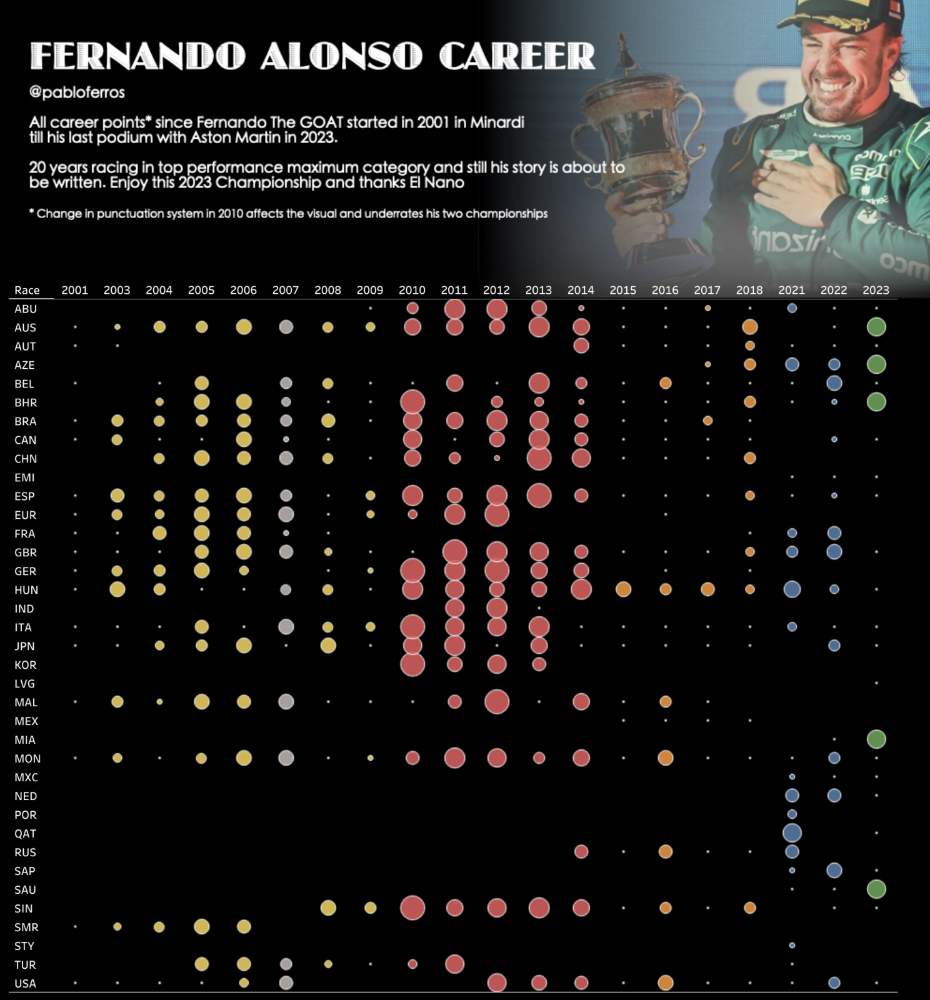
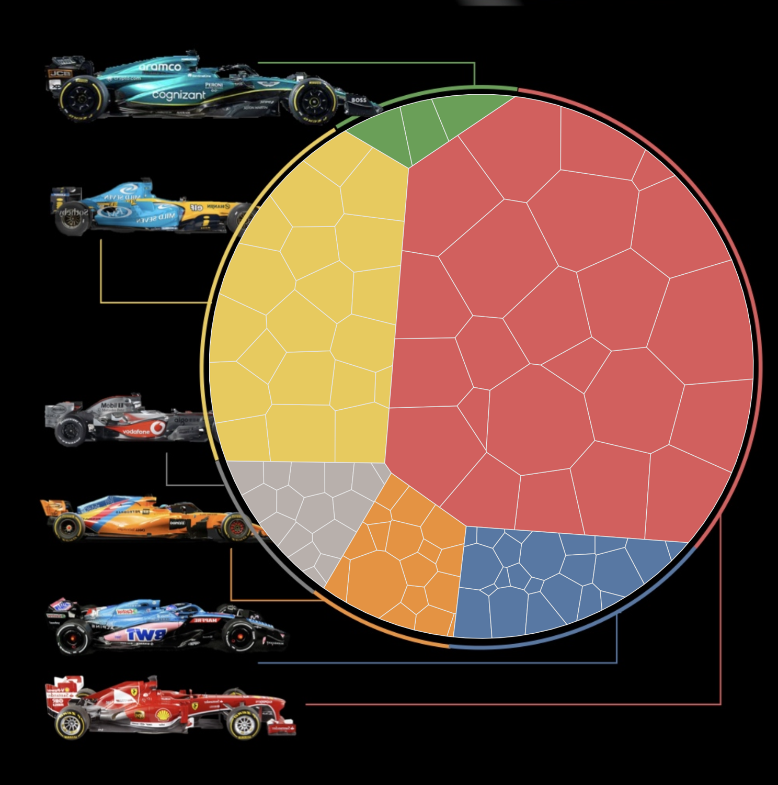
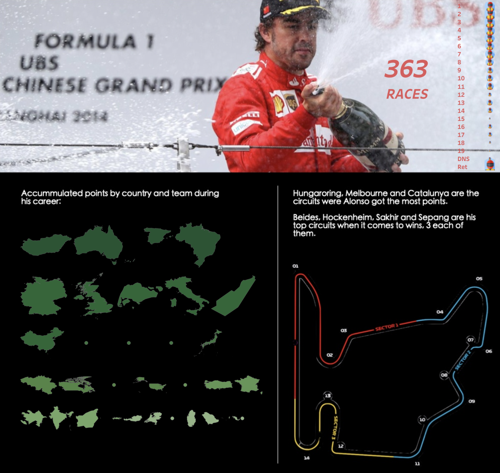
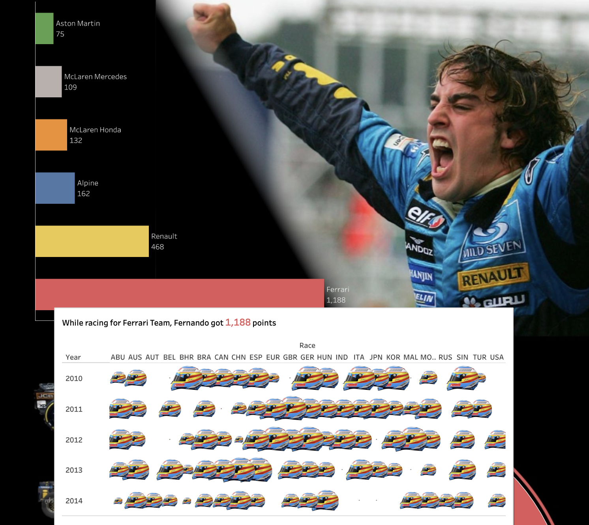

# Fernando Alonso Formula 1 Career Analysis
## A Tableau BI Project

This GitHub repository houses a comprehensive business intelligence (BI) project that I developed from scratch, focusing on the illustrious career of Formula 1 driver Fernando Alonso. This project delves into the intricate details of Alonso's racing journey, providing valuable insights and visualizations through a Tableau workbook.

https://public.tableau.com/app/profile/pabloferros/viz/FernandoAlonsoF1Career/Dashboard1

With meticulous data collection and analysis, this BI project showcases the major milestones, achievements, and statistical highlights of Alonso's Formula 1 career. It covers various aspects, including his race performances, championship wins, team affiliations, lap times, and more. By leveraging Tableau's powerful visualization capabilities, the repository offers an interactive and immersive experience, enabling users to explore and comprehend the data effortlessly.

The repository contains the complete source code and documentation (csv files inside the Tableau Public workbook), ensuring transparency and reproducibility for fellow data enthusiasts and Formula 1 fans. It provides a step-by-step guide on how to replicate the project, from data extraction and cleaning to transforming and visualizing the data in Tableau.

Whether you are a Formula 1 or El Nano aficionado, a data analyst, or someone curious about Fernando Alonso's incredible career, this BI project offers a comprehensive and engaging exploration of his journey on the racetrack. Feel free to explore the repository, gain insights, and leverage the code and visualizations for your own analyses and projects.

